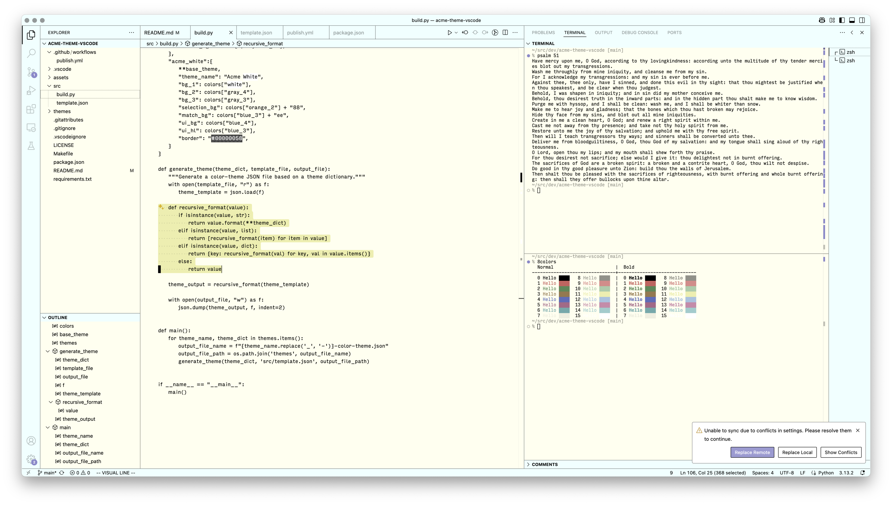

# Acme theme

A set of VS Code themes inspired by the [Acme editor](https://en.wikipedia.org/wiki/Acme_%28text_editor%29).

This theme collection includes four variants:
- **Acme**: Light theme with warm pale yellow backgrounds (classic Acme aesthetic)
- **Acme White**: Light theme with clean white backgrounds and blue accents
- **Dark Acme**: Dark theme with warm brownish backgrounds
- **Dark Acme White**: Dark theme with cool gray backgrounds

Two big differences between the main theme and the original Acme editor's color scheme:

1. Comments are a faded foreground color.
2. Both light and dark variants are included for different preferences.

## Screenshot



## Recommended Settings

```
{
    "explorer.decorations.colors": false,
    "workbench.editor.decorations.colors": false,
    "search.decorations.colors": false,
}
```

## Build

Requires vsce and Python ≥ 3.11.
- Build themes: `make build`
- Build extension: `make package`